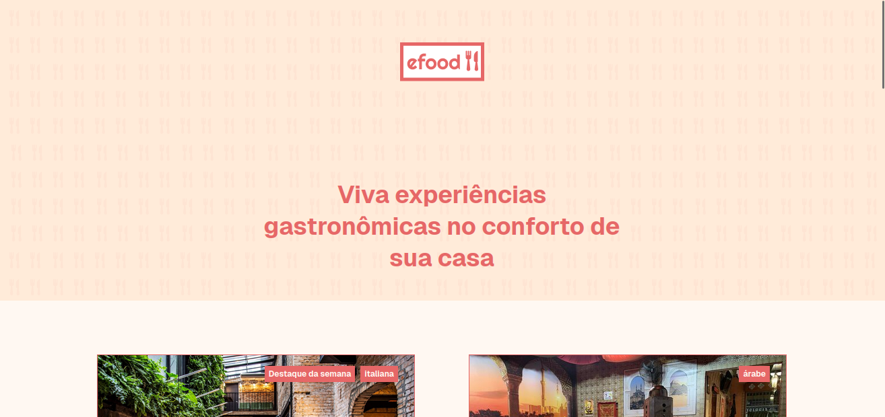
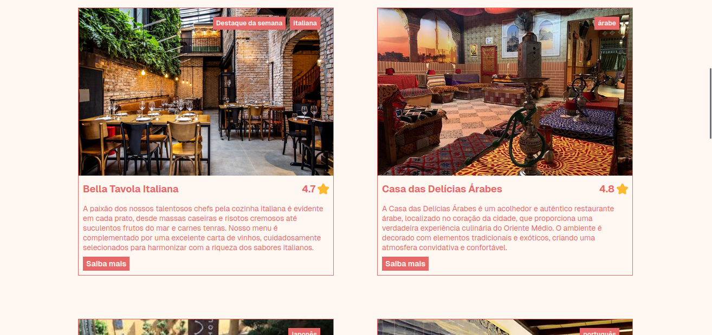
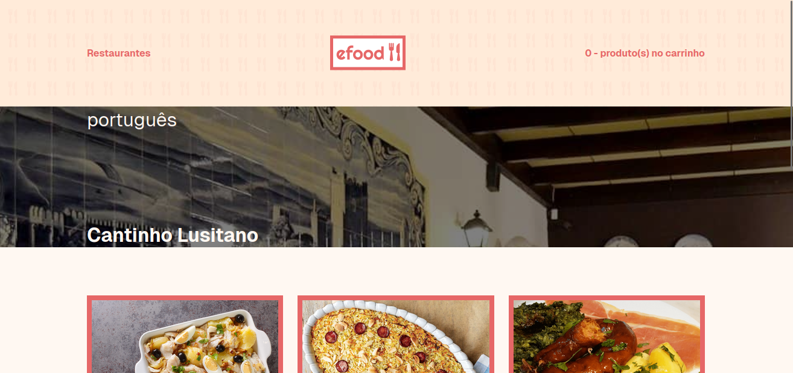
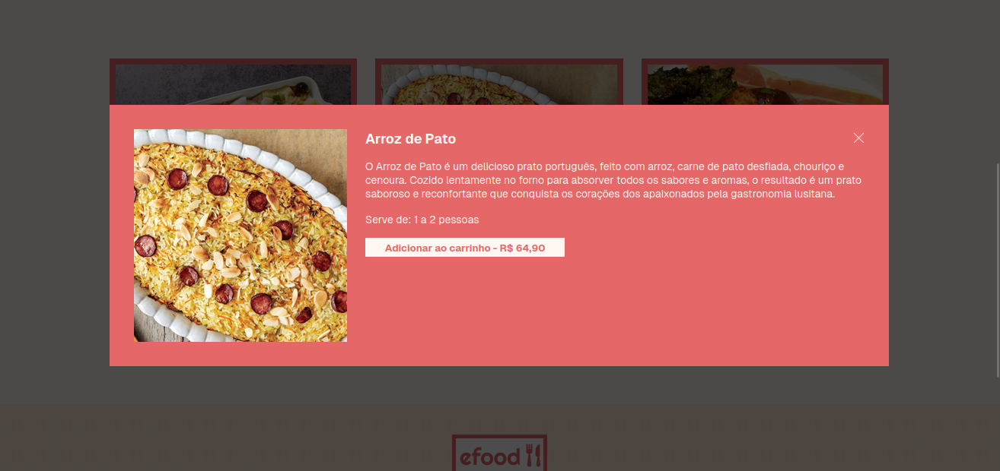
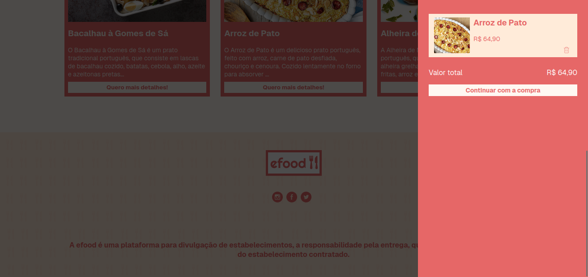
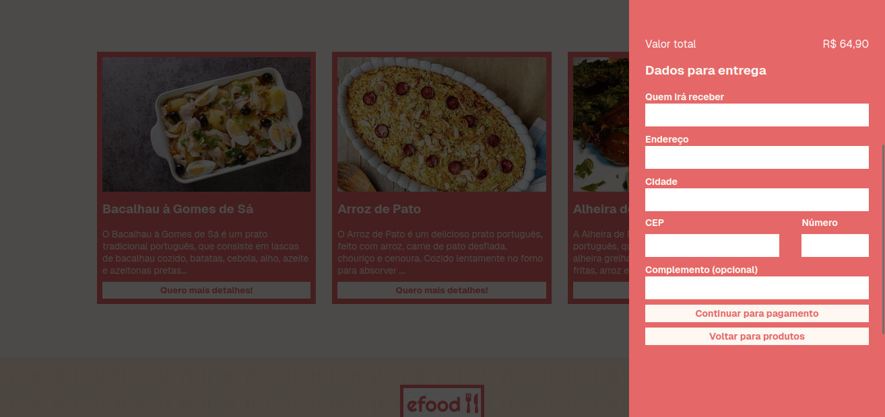
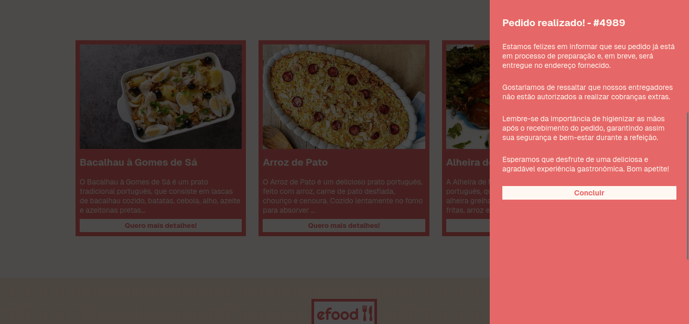

# Aplicativo de Restaurantes

Este é um aplicativo simples, desenvolvido por mim, que consome uma API de restaurantes e possibilita que usuários façam pedidos e realizem pagamentos com cartão. Este projeto foi criado para demonstrar minhas habilidades no desenvolvimento front-end e fornecer uma experiência funcional e amigável ao usuário.

---

## ✨ Funcionalidades

- **Explorar Restaurantes**: Exibe uma lista de restaurantes com detalhes como menus e avaliações.
- **Pedido Online**: Permite selecionar itens do menu e realizar pedidos diretamente pelo aplicativo.
- **Pagamento com Cartão**: Integração com gateway de pagamento para processar transações de forma segura.

---

## 🚀 Tecnologias Utilizadas

- **React**: Biblioteca principal para construção da interface.
- **Redux Toolkit Query**: Realização de chamadas à API de restaurantes.
- **Styled Components**: Estilização modular e moderna.
- **Redux Toolkit**: Gerenciamento eficiente do estado global.
- **React Formik & Yup**: Validação e gerenciamento de formulários no pagamento.

---

## 🎯 Objetivo do Projeto

Este aplicativo foi criado como parte de meu portfólio para demonstrar:
- Habilidades em consumir APIs REST e exibir dados dinamicamente.
- Capacidade de criar interfaces responsivas e intuitivas.
- Implementação de fluxos de compra e pagamento.
- Boas práticas no desenvolvimento front-end, como gerenciamento de estado e reutilização de componentes.

---

## 🖼️ Preview do Projeto

### Lista de Restaurantes

### Detalhes do Restaurante  

### Tela de Pagamento

---

## 📚 Referências

- **React**: [Documentação](https://reactjs.org/)
- **Redux Toolkit**: [Documentação](https://redux-toolkit.js.org/)
- **Styled Components**: [Documentação](https://styled-components.com/)

---

## 📩 Contato

Gostou do projeto? Entre em contato comigo!  
📧 E-mail: [rafaeldamacena9304@gmail.com](mailto:rafaeldamacena9304@gmail.com)  
🌐 LinkedIn: [Rafael Damacena](https://www.linkedin.com/in/rafaeldamacena9304/)

---

## 🏆 Agradecimentos

A todos que incentivam o desenvolvimento de soluções tecnológicas para facilitar o dia a dia das pessoas!

---

> Este projeto é parte do meu portfólio para fins educacionais e de demonstração.
